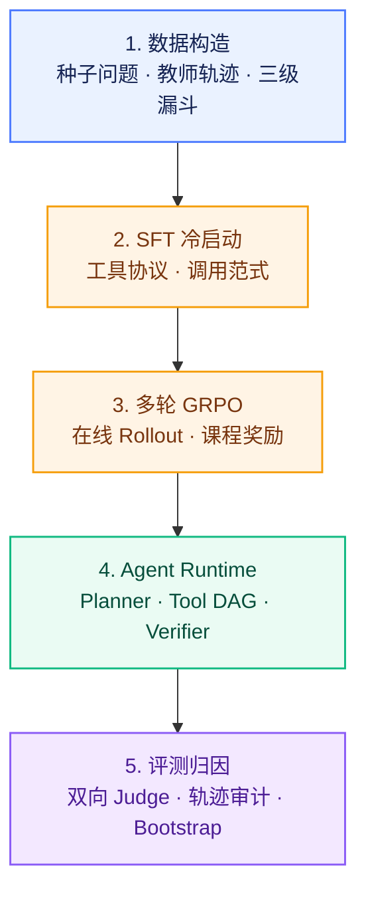
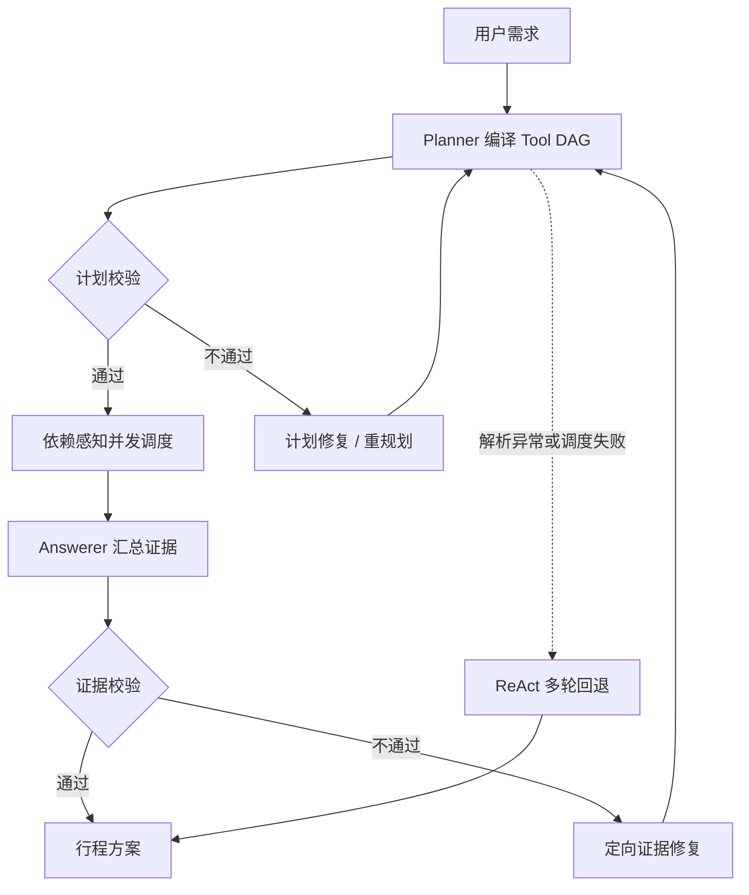

# 长程工具决策智能体

> 面向复杂出行规划，构建具备多轮工具决策、证据约束与过程优化能力的 Agentic RL 系统。

出行规划要求模型串联天气、景点、交通、住宿、餐饮与路线等多源信息，并在工具失败或信息缺失时动态调整动作。单轮问答模型在该场景下有三类结构性缺陷：未取证先作答、过程行为无约束、推理成本刚性。本项目围绕这三点完成数据、训练、执行与评测闭环。

---

## 目录

- [项目结论摘要](#项目结论摘要)
- [完整技术路线](#完整技术路线)
- [数据构造](#数据构造)
- [模型训练](#模型训练)
- [Agent 系统](#agent-系统)
- [工具与运行时](#工具与运行时)
- [恢复与可靠性](#恢复与可靠性)
- [评测方法](#评测方法)
- [核心结果](#核心结果)
- [快速开始](#快速开始)
- [仓库结构](#仓库结构)
- [当前边界](#当前边界)

---

## 项目结论摘要

项目通过 SFT 冷启动建立工具调用范式，再通过多轮 GRPO 优化工具决策与方案质量。

80 题双向配对 LLM Judge 结果：

| 对比 | 参考 | 本模型 | 增量 |
|---|---:|---:|---:|
| SFT 冷启动 vs Instruct 基线 | 6.23 | 6.51 | +0.28 |
| 多轮 GRPO vs SFT 冷启动 | 6.31 | 6.85 | +0.54 |
| 多轮 GRPO vs Instruct 基线 | 6.12 | 6.94 | +0.82 |
| 多轮 GRPO vs Qwen3-14B | 5.86 | 6.88 | +1.02 |
| Gemini 第三方裁判交叉验证 | 7.80 | 8.34 | +0.54 |

独立 Judge 重跑进一步验证：

```text
GRPO vs SFT = 6.781 -> 7.308
delta = +0.527
95% CI = [0.149, 0.912]
```

逐题结果见 [`results/original_protocol/`](results/original_protocol/README.md)。

主要结论：

- SFT 冷启动能够稳定工具调用协议；
- 多轮 GRPO 在过程奖励约束下进一步提升方案质量和工具决策；
- 4B GRPO 在同条件 Judge 评测中超过 Qwen3-14B；
- 提升同时来自答案质量、阶段行为和调用效率，而不是单纯增加工具调用次数。

---

## 完整技术路线



---

## 数据构造

### 数据漏斗

| 阶段 | 规模 |
|---|---:|
| 种子问题 | 306 |
| 教师轨迹 | 1835 |
| 三级漏斗过滤后训练集 | 1698 |
| 独立测试集 | 86 |

### 数据内容

- 天气、POI、交通、酒店、餐饮与路线工具调用；
- 多轮工具依赖和参数传递；
- 工具失败、空结果和重试轨迹；
- 证据不足时的拒答与澄清；
- 多约束行程规划与最终方案生成。

### 数据质量检查

- 工具调用格式是否可解析；
- 参数是否满足 Tool Schema；
- 工具返回和最终答案是否一致；
- 是否存在未取证先作答；
- 是否存在重复调用和无效循环；
- 最终方案是否完整满足用户约束。

---

## 模型训练

### SFT 冷启动

| 参数 | 配置 |
|---|---|
| 基座 | Qwen3-4B-Instruct |
| 训练集/验证集 | 850 / 31 |
| 方法 | LoRA 监督微调 |
| LoRA rank | 128 |
| 上下文长度 | 32K |

SFT 的目标是让模型学会：

- 结构化 Tool Call；
- 先检索再回答；
- 工具参数标准化；
- `<answer>` 输出协议；
- 基础的多轮任务拆解。

### 多轮 GRPO

| 参数 | 配置 |
|---|---|
| 起点 | SFT merged checkpoint |
| Rollout | vLLM 在线多轮，最多 13 轮 |
| 训练方法 | GRPO + DeepSpeed ZeRO-3 |
| 训练任务 | 1000 条多约束任务 |
| 采样 | 每个 prompt 6 条轨迹 |
| 温度 | 0.9 |
| KL 系数 | 0.04 |
| 学习率 | 1e-6 |
| 最大训练步数 | 200 |

### 六维课程式奖励

```text
R = w1 * R_process
  + w2 * R_schema
  + w3 * R_answer
  + w4 * R_stage
  + w5 * R_efficiency
  + w6 * R_judge
```

| 分量 | 约束目标 |
|---|---|
| 过程质量 | 中间推理与工具选择是否合理 |
| 协议格式 | Tool Call 是否可解析、字段是否合法 |
| 答案质量 | 方案是否满足用户约束 |
| 阶段行为 | 是否遵循先检索后作答 |
| 调用效率 | 是否存在冗余检索与重复调用 |
| LLM Judge | 与参考答案的语义一致性 |

三个阶段权重会逐步从格式合规转向答案质量与语义一致性。

---

## Agent 系统



核心模块：

- Planner：任务拆解与 Tool DAG 生成；
- Scheduler：依赖感知的工具并发；
- Verifier：计划校验、证据校验和定向修复；
- Answerer：汇总工具证据并生成最终方案；
- ReAct Fallback：处理解析异常和调度失败。

---

## 工具与运行时

项目注册 11 个工具：

- 网页搜索与网页访问；
- 天气查询；
- POI 搜索；
- 周边搜索；
- 路线规划；
- 火车票与航班查询；
- 酒店、餐饮和距离矩阵。

运行时包含：

- Tool Call 解析与工具分发；
- 工具结果回注；
- 异常恢复；
- 重复调用抑制；
- 轮数约束和强制收束；
- 完整消息轨迹保存。

---

## 恢复与可靠性

执行循环对四类失效模式具有显式防护：

| 失效模式 | 处理 |
|---|---|
| 工具调用未闭合 | 解析失败后要求模型自我修正 |
| 连续无效输出 | 达到阈值后终止并记录失败 |
| 相同调用重复触发 | 注入反馈并禁止继续循环 |
| 轮数耗尽未收敛 | 强制进入最终回答阶段 |

评测同时区分：

- 流程是否完成；
- 工具是否可用；
- 事实是否被证据支持；
- 是否存在安全或协议违规。

---

## 评测方法

采用原项目双向配对 LLM Judge 协议：

- 80 道同条件配对题；
- 同一题目、工具集和固定日期；
- LLM-as-a-Judge，0-10 分；
- 交换候选位置重复评分，降低位置偏差；
- 对逐题差值执行 20,000 次配对 Bootstrap；
- 保留完整轨迹并区分流程、工具与事实状态；
- 20 题用于迭代校验，60 题隐藏集用于最终验证。

评测维度包括：

- 任务相关性；
- 完整性；
- 事实安全；
- 工具调用合理性；
- 格式质量。

---

## 核心结果

| 对比 | 参考 | 本模型 | 增量 |
|---|---:|---:|---:|
| SFT 冷启动 vs Instruct 基线 | 6.23 | 6.51 | +0.28 |
| 多轮 GRPO vs SFT 冷启动 | 6.31 | 6.85 | +0.54 |
| 多轮 GRPO vs Instruct 基线 | 6.12 | 6.94 | +0.82 |
| 多轮 GRPO vs Qwen3-14B | 5.86 | 6.88 | +1.02 |
| Gemini 裁判交叉验证 | 7.80 | 8.34 | +0.54 |

独立 Judge 重跑：

| 对比 | 参考 | 目标 | 增量 | 95% CI |
|---|---:|---:|---:|---:|
| GRPO vs SFT | 6.781 | 7.308 | +0.527 | [0.149, 0.912] |
| GRPO vs Instruct | 6.728 | 7.461 | +0.734 | [0.373, 1.090] |
| GRPO vs Qwen3-14B | 6.796 | 7.286 | +0.489 | [0.023, 0.947] |
| SFT vs Instruct | 6.936 | 7.103 | +0.166 | [-0.239, 0.571] |

### 教师准入

| 指标 | 4B GRPO | 14B GRPO 教师 | 变化 |
|---|---:|---:|---:|
| 裁判均分 | 0.315 | 0.425 | +0.110 |
| 平均工具调用 | 10.95 | 3.20 | -71% |
| 流程格式合格 | 20/20 | 20/20 | 持平 |

教师模型以更少调用完成复杂任务，说明方案质量差异主要来自决策定位精度，而不是检索数量。

---

## 快速开始

安装依赖：

```bash
pip install -r requirements.txt
```

运行测试：

```bash
python3 -m pytest tests -q
```

推理：

```bash
bash scripts/infer.sh
```

SFT：

```bash
bash scripts/train_sft.sh
```

多轮 GRPO：

```bash
bash scripts/train_rl.sh
```

运行前需要根据 [`.env.example`](.env.example) 配置模型与工具服务。

---

## 仓库结构

```text
inference/                  ReAct、Tool DAG、Verifier 与交互式对话
prompts/                    系统提示词、数据质检与 Judge Prompt
tools/                      11 个旅行工具
utils/                      地图、地理计算、日志与文本工具
data_pipeline/              轨迹蒸馏、AgentPRM、OPD 与数据清洗
evaluation/                 LLM Judge、基线指标与 Tool DAG 基准
training/                   AgentPRM 与 OPD 训练
scripts/                    训练、推理和 rollout 入口
tests/                      单元测试与无 GPU 回归
docs/                       模块学习指南与功能说明
results/original_protocol/  原协议逐题 Judge 分数与汇总
```

---

## 当前边界

- 仓库不包含模型权重、训练数据和运行产物；
- 真实工具调用需要自行配置 API Key；
- 训练需要 GPU、vLLM、DeepSpeed 和 ms-swift 环境；
- Judge 评测需要外部裁判模型服务；
- 结果来自 80 题双向配对评测，不代表任意线上流量分布。
